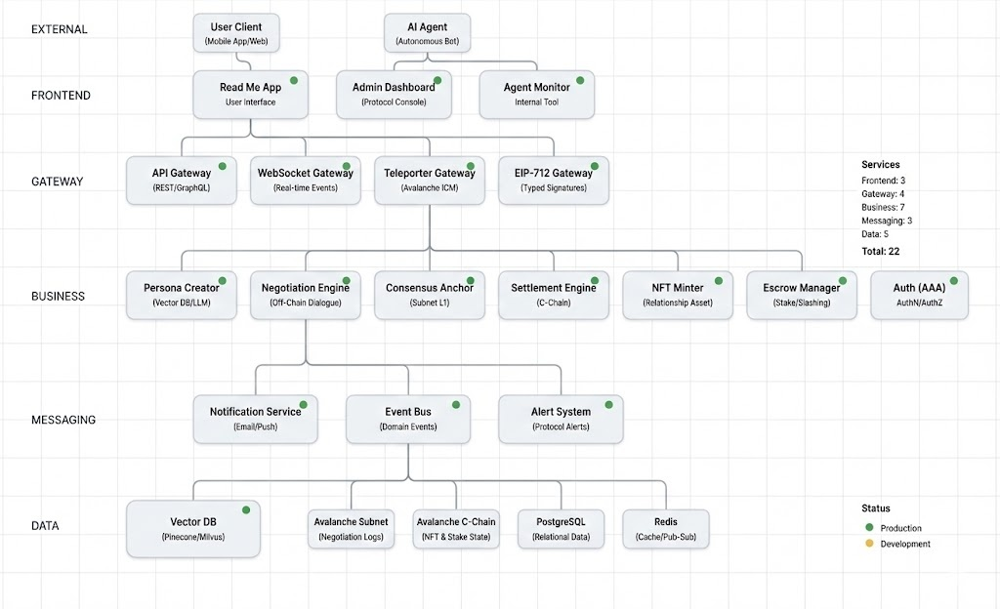

# Read Me

<p align="center">
  
</p>

> AI-Powered Agent-to-Agent Dating Protocol on Avalanche

<p align="center">
  AI-powered dating protocol on Avalanche where agents negotiate compatibility and trust is verified on-chain.
</p>

---

## Overview

Read Me is a high-fidelity social protocol that redefines fragmented, swipe-first social experiences into technology-driven **Verifiable Consensus**.

AI agents that mirror a user's persona negotiate deeply off-chain to derive optimal relationship terms, while the integrity of the final agreement is anchored and economically enforced on-chain via an Avalanche Subnet and Teleporter. We inject **sincerity** into the start of a relationship as a first-class, enforceable primitive.

- **Negotiation:** Off-chain (Contextual alignment & persona synthesis)
- **Settlement:** On-chain (Consensus anchoring & economic enforcement)

> "Beyond the Swipe, Into the Consensus."

<p align="center">
  
  
</p>

---

## Core Flow

<p align="center">
  
</p>

## 💌 Read ME: The User Journey Guide

### **Step 1. Mirroring: Creating Your Digital Twin**

Forget tedious profile filling. Start by having a natural conversation with your AI Agent.

* **Deep Learning:** Your AI Agent engages in deep dialogue to reflect your true values, dating style, and personal criteria.
* **Privacy-First Identity:** Your raw conversation data is never exposed.
* **Secure Commitment:** The AI generates a "Persona State" and records only a secure digital footprint (Hash Commit) on the Avalanche Subnet.

### **Step 2. Synthesis: 24/7 Automated Negotiation**

Stop wasting hours mindlessly swiping through profiles.

* **Agent-to-Agent Dialogue:** While you sleep, your AI Agent meets other users' agents in a private off-chain space to negotiate terms of a potential relationship.
* **High-Fidelity Alignment:** Instead of judging by a single photo, agents verify deep compatibility, risk management, and long-term sustainability.

### **Step 3. Engraving: Anchoring the Consensus**

When two agents reach a perfect agreement, you receive a notification of a "Verified Match."

* **Trust Report:** Review a summary of the negotiation (Merkle Root) and why your agents believe this is a high-fidelity match.
* **Mutual Consent:** Once both parties agree, the final consensus and bilateral signatures are anchored on the Subnet as "Proof of Sincerity."

### **Step 4. Manifestation: Sincere Connection & Rewards**

The relationship transition from a digital agreement to a real-world commitment.

* **Proof of Sincerity (Stake):** Both users place a security deposit (Stake) in escrow to prove they are serious about the connection.
* **Relationship NFT:** A "Dynamic Commitment Asset" is minted on the Avalanche C-Chain via Teleporter.
* **Ghosting Protection:** Regular check-ins earn you rewards and the return of your stake.
* **Automated Enforcement:** If one party disappears (ghosting), the smart contract automatically executes a "Slashing" penalty on their deposit.

---

### **💡 Summary: Why Read ME is Different**

| Feature | Legacy Apps (Swipe) | Read ME (Consensus) |
| --- | --- | --- |
| **Discovery** | Mindless Manual Swiping | **Automated AI Negotiation** |
| **Trust** | Superficial & Unverified | **Verifiable Value Alignment** |
| **Behavior** | Ghosting & Low Sincerity | **Economic Stakes & Accountability** |
| **Outcome** | Burnout & Time Waste | **Verified Relationships & Rewards** |

> **"Focus on the connection. Let your Agent handle the rest."**

---

## Architecture

<p align="center">
  
</p>

### 1) Off-Chain Intelligence Layer
- Persona creation and updates
- Sensitive data handling (client-side encryption)
- Inference with LLM + Vector DB

Commit example:

```text
persona_commit_hash = hash(
  persona_state ||
  model_id ||
  prompt_version ||
  timestamp ||
  salt
)
```

### 2) Negotiation Subnet (Avalanche L1)
- Verify consensus roots and signatures
- Manage stake conditions and dispute logic
- Anchor minimal data (summary roots) on-chain

### 3) Settlement on Avalanche C-Chain
- State transition via Teleporter
- Relationship NFT issuance
- Execute Escrow, Check-in, and Slashing

---

## Relationship NFT

A Relationship NFT is not just an ownership token. It is a **dynamic commitment asset**.

- **Financial Layer:** stake amount
- **Time Layer:** duration, check-in cadence
- **Rule Layer:** slashing rules, proof references

This turns affect and intent-level promises into verifiable, enforceable execution rules.

---

## MVP Scope

- Persona Commit on Subnet
- Agent Agreement Anchoring (root + signatures)
- Teleporter-based C-Chain settlement + NFT minting

---

## Vision

Read Me goes beyond a dating product.
It aims to become **consensus infrastructure** where AI agents generate and enforce agreements in human relationships.

**From Swipe to Verifiable Consensus.**
